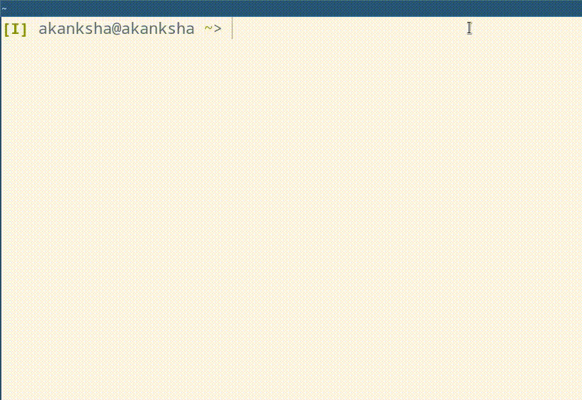

# trail
`trail` is command line tool which keeps only the last n lines of a stream on the terminal screen.


It behaves exactly as `tail` command if the input is not a continuos stream. Otherwise it behaves as if tail is being run at every point of time.




## Arguments
`trail` command only accept one optional argument:
```
-l, --lines (default: 5)
	Defines how many lines should be kept on terminal.
	To disable trailing pass 0.
```


## Examples
```sh
# Will show results of only recent 10 pings
ping 8.8.8.8 | trail_lines --lines 10

# Will behave similar to `tail` command 
ls | trail_lines -l 20
```

## 